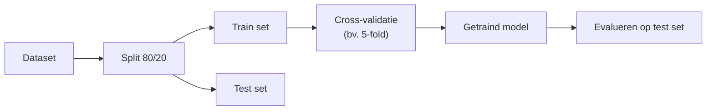
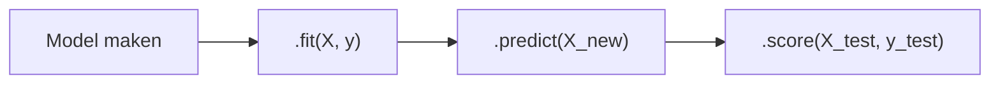
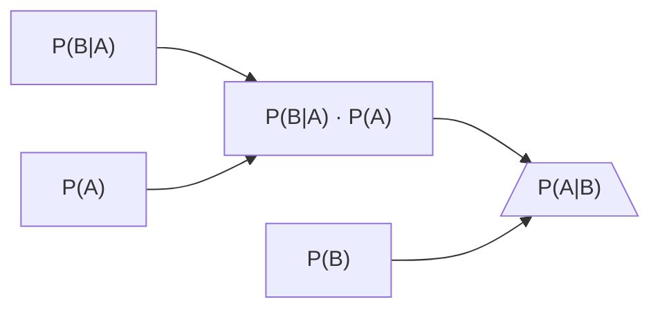
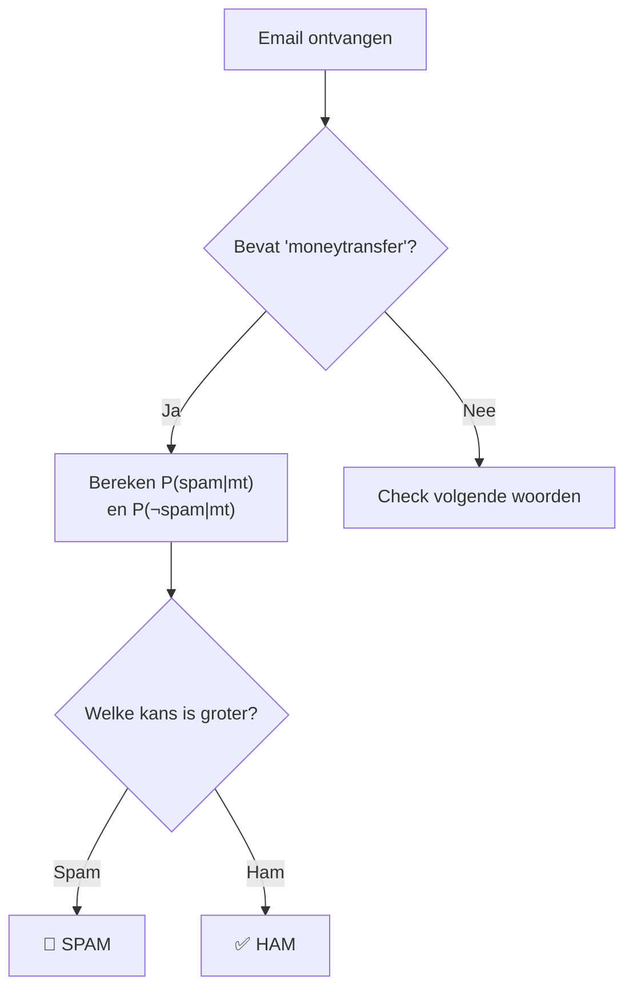
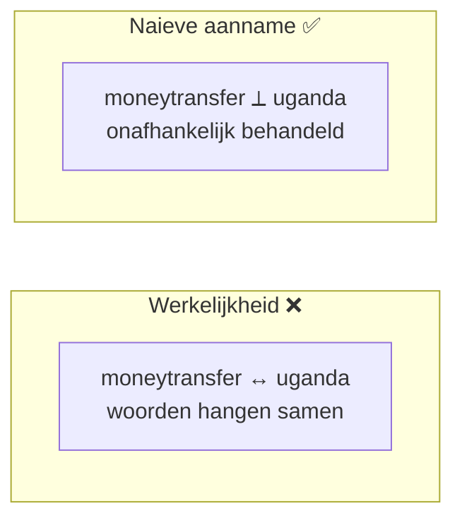
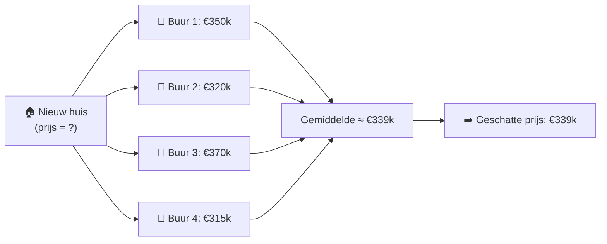
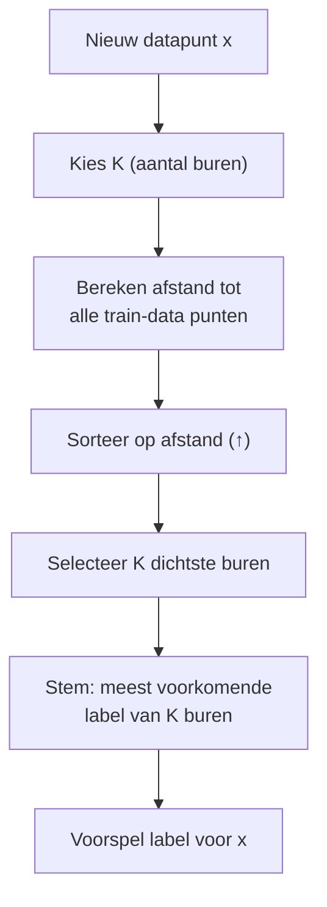

<!-- _class: title-slide -->

# Week 1
## Classificatie met Naive Bayes, KNN

---

<!-- _class: red-bg -->
# Herhalen

---

## Wat weten jullie hier nog over ?

- Classificatie vs Clustering
- Supervised (begeleid) vs Unsupervised (onbegeleid)
- Underfitting & Overfitting
- Train / Test / Validation data
- Cross-validatie

---



---
---
<!-- _class: red-bg -->
## Scikit-learn

De standaard ML-bibliotheek voor Python

---

## Wat is scikit-learn?

- **Bekendste ML-bibliotheek** voor Python — gebouwd op NumPy & SciPy
- **Wat kan het?**
  - Classificatie (o.a. Naive Bayes, KNN, SVM, …)
  - Regressie
  - Clustering
  - Dimensionality reduction
  - Preprocessing & feature engineering
  - Model selectie & evaluatie (cross-validatie, metrics)

---

- **Open source** (BSD-licentie) — gratis, ook voor commercieel gebruik
  - Ontwikkeld door INRIA (Frans onderzoeksinstituut) en de community
  - Volledige broncode op GitHub
  - Actieve community, uitgebreide documentatie

---

## Consistent API: één patroon voor élk algoritme

Elk schattingsalgoritme ("estimator") in scikit-learn volgt dezelfde structuur:

```python
from sklearn.xxxx import SomeModel

model = SomeModel(hyperparameter=waarde)  # 1. Maak model
model.fit(X, y)                          # 2. Leer uit data
model.predict(X_new)                     # 3. Voorspel
model.score(X_test, y_test)              # 4. Evalueer
```



> **Waarom?** Eén patroon leren = **alle** algoritmes in deze cursus kunnen gebruiken!

---

## ... en nog meer herbruikbare methodes

| Methode | Gebruik | Voorbeeld |
|---------|---------|-----------|
| `.fit(X, y)` | Train het model | `knn.fit(X_train, y_train)` |
| `.predict(X)` | Voorspel labels | `knn.predict(X_test)` |
| `.score(X, y)` | Bereken nauwkeurigheid | `knn.score(X_test, y_test)` |
| `.transform(X)` | Transformeer data (preprocessing) | `scaler.transform(X_test)` |
| `.fit_transform(X)` | Fit + transform in één stap | `scaler.fit_transform(X_train)` |

> **Opgelet:** `.fit()` en `.predict()` zijn **altijd** beschikbaar voor supervised modellen; `.transform()` enkel voor preprocessing / unsupervised.

---
<!-- _class: red-bg -->
## Naive Bayes

Een eerste classifier

---

## Naive Bayes — historische noot

- **Thomas Bayes (1701–1761)** — Engelse predikant en wiskundige
  - Zijn stelling werd **postuum** gepubliceerd in 1763 door zijn vriend Richard Price
- **Pierre-Simon Laplace (1749–1827)** — Franse wiskundige
  - Herontdekte en generaliseerde Bayes' werk onafhankelijk → **Bayes–Laplace-stelling**

---
- **Eerste ML-toepassing:** M.E. Maron (1961) gebruikte Naive Bayes voor automatische indexering van documenten
  - [doi.org/10.1145/321075.321084](https://doi.org/10.1145/321075.321084)
- **Spamfilter-revolutie (jaren 1990–2000):** Naive Bayes werd de standaard voor e-mail filtering
  - Sahami et al., 1998: [aaai.org/Papers/Workshops/1998/WS-98-05/WS98-05-004.pdf](https://www.aaai.org/Papers/Workshops/1998/WS-98-05/WS98-05-004.pdf)
  - Graham, 2002: [paulgraham.com/spam.html](https://paulgraham.com/spam.html)
- **Waarom "naief"?** — De aanname van onafhankelijkheid is al sinds de jaren 1960 gekend als *onrealistisch*, toch blijft de classifier verrassend goed presteren 🎯

---

## Conditionele kans (voorwaardelijke kans)

- $P(A \mid B)$: kans op **A** als **B** al gebeurd is

- **Definitie:**
  $$P(A \mid B) = \frac{P(A \cap B)}{P(B)}$$

- **Voorbeeld — Dobbelsteen:**
  - $P(\text{twee keer zes}) = 1/36 = P(A \cap B)$
  - $P(\text{één keer zes}) = 1/6 = P(B)$
  - $P(\text{twee keer zes} \mid \text{al één keer zes}) = \frac{1/36}{1/6} = \frac{1}{6}$

---

## Regel van Bayes — formule

$$P(A \mid B) = \frac{P(B \mid A) \; P(A)}{P(B)}$$

Alternatieve vorm (handig in de praktijk):

$$P(A \mid B) = \frac{P(B \mid A) \, P(A)}
            {P(B \mid A) P(A) + P(B \mid \neg A) P(\neg A)}$$

---
# Bayes Rule flow



---

## Regel van Bayes — in ML-context

- **B** = data / feiten (de e-mail)
- **A** = het classificatielabel dat we willen toekennen (spam / ham)

We willen dus berekenen:

$$P(\text{label} \mid \text{data})$$

> "Wat is de kans op dit label, **gegeven** de data die we zien?"

---

## Spamfilter — probleemstelling

We bouwen een **spamfilter** dat e-mails labelt als **'spam'** of **'geen spam'**.

**Gegeven:**
- $P(\text{moneytransfer} \mid \text{spam}) = 0.4 \quad$ (40% van spam bevat 'moneytransfer')
- $P(\text{moneytransfer} \mid \neg\text{spam}) = 0.0001 \quad$ (0.01% van ham bevat het)
- $P(\text{spam}) = 0.45 \quad$ (45% van alle e-mail is spam)

**Vraag:** Een e-mail bevat 'moneytransfer' — is het spam?

---



---

## Moneytransfer → Spam?

**Berekening via Bayes:**

$$
\begin{aligned}
P(\text{spam} \mid \text{mt})
&= \frac{P(\text{mt} \mid \text{spam}) \, P(\text{spam})}
        {P(\text{mt} \mid \text{spam}) P(\text{spam}) + P(\text{mt} \mid \neg\text{spam}) P(\neg\text{spam})} \\[6pt]
&= \frac{0.4 \times 0.45}{0.4 \times 0.45 \;+\; 0.0001 \times 0.55} \\[6pt]
&\approx 0.9997
\end{aligned}
$$

**Besluit:** $P(\text{spam} \mid \text{mt}) \approx 99.97\%$ → label = **spam** 🚫

---

## Meerdere woorden screenen — gegevens

| Woord | $P(\text{woord} \mid \text{spam})$ | $P(\text{woord} \mid \neg\text{spam})$ |
|-------|:---:|:---:|
| 'moneytransfer' | $0.4$ | $0.0001$ |
| 'uganda' | $0.1$ | $0.05$ |
| 'AP Hogeschool' | $0.001$ | $0.3$ |

**Vraag:** Een e-mail bevat **niet** 'moneytransfer', maar **wel** 'uganda' en 'AP Hogeschool'.  
Wat is de kans op spam?

---

## Meerdere datapunten — berekening

**Naieve aanname:** woorden zijn onafhankelijk → product van kansen

**Voor spam:**
$$P(\neg\text{mt} \mid \text{spam}) \times P(\text{ug} \mid \text{spam}) \times P(\text{ap} \mid \text{spam}) \times P(\text{spam})$$

**Voor geen spam:**
$$P(\neg\text{mt} \mid \neg\text{spam}) \times P(\text{ug} \mid \neg\text{spam}) \times P(\text{ap} \mid \neg\text{spam}) \times P(\neg\text{spam})$$

> **Uiteindelijk:** kies het label met **grootste teller** — de noemer $P(\text{data})$ is voor beide gelijk, dus hoef je niet uit te rekenen!

---



---

## Naive Bayes Classifier

### Waarom "naief"?

- De kansen van woorden **samen** en **apart** zijn niet onafhankelijk — in werkelijkheid beïnvloeden ze elkaar.
- Toch werkt deze classifier **in de praktijk verrassend goed**, dus we negeren dit bezwaar.

### Laplace-smoothing

Als $P(x_i \mid y=k) = 0$ voor een label, wordt het hele product $0$.

**Oplossing:** tel een kleine waarde $\delta$ op:

$$P(x_i \mid y=k) = \frac{\delta + \#(x_i, y=k)}{\sum_j (\delta + \#(x_j, y=k))}$$

- $\delta$ wordt bepaald via cross-validatie.

---

### Implementatie in sklearn

```python
from sklearn.naive_bayes import BernoulliNB
clf = BernoulliNB()
clf.fit(X, Y)
clf.predict(X[2:3])
```

> Volgende stap: het trainen van de data flexibeler maken → **Labo!**

---
<!-- _class: red-bg -->
## K-Nearest Neighbours (KNN)

---
## KNN — historische noot

- **Fix & Hodges (1951)** — Eerste beschrijving van het "nearest neighbor"-beslissingsregel
  - US Air Force technisch rapport: een **niet-parametrische** classifier — geen aannames over de onderliggende verdeling
  - Zie: [en.wikipedia.org/wiki/K-nearest_neighbors_algorithm](https://en.wikipedia.org/wiki/K-nearest_neighbors_algorithm)
- **Cover & Hart (1967)** — Baanbrekend artikel "Nearest neighbor pattern classification"
---
  - Bewezen: met voldoende data is de fout van 1-NN **hoogstens 2× de Bayes-optimale fout**
  - [doi.org/10.1109/TIT.1967.1053964](https://doi.org/10.1109/TIT.1967.1053964)
- **"Lazy learning"** — al in de jaren 1950 gekend: geen echte trainingsfase, alle data wordt opgeslagen
- **1990–2010** — KNN breed toegepast in patroonherkenning, beeldclassificatie en aanbevelingssystemen (collaborative filtering)

> 📌 KNN is één van de **oudste** en **simpelste** ML-algoritmes — maar nog steeds relevant!

---

## Wat bepaalt de prijs van een huis?

**Locatie, locatie en nog eens locatie!**



<!--
💡 In de originele slides stonden hier 4 slides (14-17) met herhaling.
    Dit Mermaid-diagram vat het hele concept in één slide!
-->

---

## KNN — Basisidee

**Gelijkaardige dingen zijn dicht bij elkaar.**

**Algoritme:**
1. **Kies** $K$ = aantal buren om rekening mee te houden
2. **Voor een nieuw punt:**
   - Bereken de $K$ **dichtste** datapunten
   - Het **meest voorkomende label** van die $K$ punten = voorspelling

> 📌 Training kost nauwelijks tijd — maar **classificatie is traag** (veel afstanden berekenen)

---

---

## KNN — Eigenschappen (1)

- **Supervised learning** — zowel binary als multiclass
- Werkt **enkel** als er een notie van **afstand** is tussen datapunten
- **Numerieke data:** normaliseren is **verplicht!**
  - Anders krijgen features met grote waarden onbedoeld meer gewicht
- **Categorische data:** zelf een metriek definiëren
  - Bv. vogelvluchtafstand tussen steden, of **one-hot encoding**

---

## KNN — Eigenschappen (2)

- $K$ moet **op voorhand** gekozen worden
  - Te kleine $K$ → gevoelig voor ruis (overfitting)
  - Te grote $K$ → te veel middeling (underfitting)
  - **Oplossing:** kies $K$ via **cross-validatie**

- **Training:** goedkoop (enkel data opslaan) ✅
- **Classificatie:** duur (alle afstanden berekenen) ❌

> KNN is een **lazy learner** — er is geen echte trainingsfase.

---

## KNN — Visueel (2 kolommen)


- **$k = 5$**
- Het algoritme vindt **4 rood** en **1 groen** label
- ➡️ Voorspelling voor het nieuwe punt = **rood**

---

## Implementatie met Python & sklearn

**Optie 1 — Zelf implementeren (zie labo)**

**Optie 2 — Scikit-learn:**

```python
from sklearn.neighbors import KNeighborsClassifier

knn = KNeighborsClassifier(n_neighbors=5)
knn.fit(X_train, y_train)
predictions = knn.predict(X_test)
```

### Belangrijk!
- ✅ Normaliseer features **vóór** KNN
- ✅ Kies $K$ via cross-validatie, niet "op het gevoel"
- ✅ Gebruik `.fit` / `.predict` — dit patroon komt overal terug in sklearn
